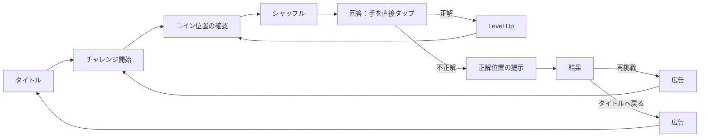

# どっち — ゲームデザインドキュメント（GDD）

| 項目           | 内容                              |
| -------------- | --------------------------------- |
| プロジェクト名 | どっち / Which One                |
| 文書種別       | ゲームデザインドキュメント（GDD） |
| ステータス     | Draft                             |
| 最終更新       | 2026-07-30                        |
| 上位文書       | [企画書（Vision）](vision.md)     |

---

## 1. この文書の役割

本書は「どっち」の**遊び方とゲーム中の振る舞い**を定義する。対象は、ルール、画面遷移、難易度、演出、シャッフル設計、広告およびランキングの体験設計である。

実装上のクラス構成、状態管理、永続化、通信、データ構造はTDDで定義する。

---

## 2. デザイン目標

- プレイヤーはコインを持つ手を観察し、所在を見抜く。
- 難しさは速度そのものではなく、リズム、交差、停止、視線誘導、フェイントから生む。
- 1問ごとの結果は即座に分かり、再挑戦までの距離を短くする。
- 1回のチャレンジではLevel 1から開始し、不正解になるまで上を目指す。
- 成果は最高到達レベルのみとし、称号・収集・育成要素は設けない。

### 2.1 基本用語

| 用語           | 定義                                                             |
| -------------- | ---------------------------------------------------------------- |
| チャレンジ     | Level 1から不正解まで連続して遊ぶ、1回のプレイ単位。             |
| レベル         | 1シャッフル・1回答からなる問題単位。正解すると次のレベルへ進む。 |
| シャッフル     | コインを保持する手と、注意を逸らす手が行う一連の動き。           |
| 正解位置       | シャッフル終了時にコインを保持している手の位置。                 |
| 最高到達レベル | 正解したレベルの最大値。初回のLevel 1で不正解の場合は0とする。   |

---

## 3. コアループ

- 正解したレベルの次は、難易度を上げた新しいシャッフルを出題する。
- 不正解になった時点でチャレンジは終了する。
- シャッフル終了後の回答フェーズには時間制限を設け、制限時間内に選択しなければ不正解とする。初期値は全レベル30秒とし、時間の速さはランキング評価に使わない。
- 制限時間はレベルごとに設定可能とし、将来は難易度設定に応じて短い制限時間をランダムに出題できるようにする。1問の回答開始後に制限時間を変更せず、選ばれた残り時間は常に表示する。
- 中断・再開およびチャレンジ中の離脱時の扱いはTDDとRoadmapで確定する。

---

## 4. 画面と状態

### 4.1 タイトル

表示要素は最小限とする。

- タイトル「どっち」
- `START`
- 目立ちすぎないランキングアイコン
- 必要最低限の設定導線

ランキングアイコンをタップした場合のみ、ランキング画面を開く。ランキングや共有への導線を結果画面に置かない。アイコンには、視認性とアクセシビリティのためのラベルを付与する。

### 4.2 コイン位置の確認

1. 演者の手を静止させる。
2. コインがどの手にあるかを明確に見せる。
3. コインを手の中へ収め、短い間を置いてシャッフルを開始する。

初級では、コインと保持する手の対応を見誤らない十分な表示時間を確保する。ここで難しくしない。

### 4.3 シャッフル

- プレイヤーの入力を受け付けない観察フェーズ。
- コイン保持手、誘導手、妨害手、フェイント手がタイムラインに沿って動く。
- コインの保持状態は内部的に常に一意に決まっている。
- 見た目上の手の重なりや画面外移動は許容するが、プレイヤーに観察可能な因果を残す。
- 背景UIや通知で集中を妨げない。

### 4.4 回答

シャッフルが完全に停止した後、短い「どちらでしょう？」の演出を出し、候補となる**手そのもの**を直接タップさせる。

- 「左」「右」などの文字ボタンは使わない。
- 候補でない装飾部分はタップ対象にしない。
- 誤タップ防止のため、各手の実際の見た目より広い透明タップ領域を持たせる。
- 回答を選んだ直後に、再入力を無効化する。
- 回答開始から時間を計測する。制限時間切れは不正解として扱い、正解位置の提示へ進む。
- 回答時間の速さは、ランキングの評価に使わない。

### 4.5 正解

- 正解した手を明快に強調する。
- 短い正解SEと、抑制した視覚演出を再生する。
- `LEVEL n` の達成を一瞬だけ示し、次のレベルのコイン確認へ自動で進む。
- 長いスコア演出や報酬表示は行わない。

### 4.6 不正解・結果

不正解時は、選んだ手と正解位置を明確に区別して見せる。シャッフルのリプレイは実施しない。

次の3要素だけを持つ結果画面へ遷移する。

- 今回の最高到達レベル
- 正解位置
- `RETRY`

結果画面にランキング、共有、称号、詳細な統計は表示しない。`RETRY`またはタイトルへ戻る操作を選んだ後に広告を表示し、広告終了後に選択した遷移先へ進む。ランキングはタイトルのアイコンから確認する。

---

## 5. 画面外・背後位置の回答表現

高難易度では、画面外または背後の演者へコインが渡る。シャッフル中は、その演者本人を画面内に表示しない。プレイヤーはコインの軌道、手の動き、効果音から移動を読み取る。

ただし、回答時にタップできない候補を作らないため、回答フェーズでは背後の手を**前景の手の背後から差し出しているように**表現する。

1. 背後候補は、前景の手より暗い黒〜濃いグレーを基調にし、影と低い彩度で奥行きを表す。
2. 前景と重なる場合も、手の輪郭・指先・タップ範囲が判別できるコントラストを確保する。
3. 背後の手も前景と同じく十分に広いタップ領域を持たせる。暗さや重なりを理由に選べない状態を作らない。
4. 演者の顔・体・衣装は表示しない。プレイヤーに示すのは「背後の位置にある手」という回答対象だけである。
5. 背後位置は真後ろ、右後ろ、左後ろの3箇所に固定する。前後・左右の位置関係を全レベルで維持し、位置ラベルには頼らず空間配置を学習できるようにする。

この設計により、「背後の演者はシャッフル中に見えない」という情報ゲーム性と、「手を直接タップする」という回答の一貫性を両立する。

---

## 6. レベル進行と難易度

### 6.1 上昇方針

各レベルは、直前のレベルより少なくとも1つの認知的な難しさを追加または強化する。速度だけを一律に上げない。

| 難しさの軸 | 内容                                                     |
| ---------- | -------------------------------------------------------- |
| 手の数     | 観察対象となる手・演者を増やす。                         |
| 軌道       | 左右移動から、上下、曲線、交差へ広げる。                 |
| リズム     | 一定速度から、停止、急加速、緩急へ広げる。               |
| 視線誘導   | コインを持たない手による横切り、対称移動、妨害を加える。 |
| フェイント | コインの移動に見えるが、実際は移動しない動きを加える。   |
| 空間       | 前後関係、画面外、背後位置、効果音からの推測を加える。   |

### 6.2 難易度帯のたたき台

レベル番号は固定のゴールではない。以下は初期バランスを作るための目安であり、プレイテストで調整する。

| レベル帯 | 主な構成             | 追加する難しさ                                                              |
| -------- | -------------------- | --------------------------------------------------------------------------- |
| 1–3      | 演者1人・手2本       | 明快な左右移動。一定のリズムで追跡を学ぶ。                                  |
| 4–6      | 演者1人・手2本       | 上下・曲線・短い停止を加える。                                              |
| 7–9      | 演者1人・手2本       | 交差、横切り、緩急、見せかけの動きを加える。                                |
| 10–14    | 前景の演者2人・手4本 | 複数の手、受け渡し、視線誘導を加える。                                      |
| 15–19    | 前景の演者3人・手6本 | 前景内の受け渡し、交差、複数のフェイントを加える。                          |
| 20以降   | 演者4〜6人・手7〜9本 | 4人目以降を背後に置き、画面外・背後への受け渡しと音による手掛かりを加える。 |

新しい難しさを導入する最初のレベルでは、他の要素を少し抑え、プレイヤーがルールを学べる余地を残す。

演者は最大6人とする。1〜3人目は前景で受け渡しを行い、各演者が2本の手を使う。4人目は真後ろ、5人目は右後ろ、6人目は左後ろに配置し、背後の各演者は1本の手だけを使う。したがって、同時に扱う手は最大9本とする。

### 6.3 難易度の上限

難易度は無制限に速度を上げない。次の状態を検知した場合は、新しい難しさの導入または出題頻度の調整を優先する。

- テストプレイヤーが動きを追う前に視認できなくなる。
- 不正解の理由を説明できない。
- 特定のレベルで正答率が極端に低く、再挑戦意欲につながらない。

数値の許容範囲、最終的なレベル上限、難易度カーブはプレイテストをもとにRoadmapで決める。

---

## 7. シャッフル設計

### 7.1 手の役割

| 役割         | 目的                                                       |
| ------------ | ---------------------------------------------------------- |
| コイン保持手 | コインを持つ唯一の手。実際の位置を決める。                 |
| 視線誘導手   | プレイヤーの注意をコイン保持手から逸らす。                 |
| 妨害手       | 交差や前方通過で一時的に視認を難しくする。                 |
| フェイント手 | コインを渡したように見せるが、実際には保持状態を変えない。 |

1本の手はタイムライン上で複数の役割を持てる。ただし、各時点でコイン保持手は必ず1本だけである。

### 7.2 シャッフルの原則

- シャッフルは、開始時の保持手、実際の受け渡し、終了時の保持手が追跡可能な連続動作である。
- すべての受け渡しには、視覚または音による手掛かりを少なくとも1つ残す。
- フェイントは、プレイヤーが事後に「本当の受け渡しではなかった」と理解できる動きにする。
- 完全な隠蔽、瞬間移動、見えない状態での無根拠な保持手変更は禁止する。
- 同じレベルでも、コインの開始位置、軌道、フェイントの位置を変え、暗記だけでの突破を防ぐ。

### 7.3 動作プリミティブ

シャッフルは、以下の組み合わせで作る。

- 移動：直線、曲線、円弧、上下移動
- 交差：前後または左右の手が重なる
- 停止：短い静止でリズムを切る
- 受け渡し：2本の手の接触を伴ってコイン保持手を変更する
- フェイント：接触や投擲に見えるが、保持手を変更しない
- 画面外移動：画面端へ抜ける、または背後方向へ移る
- 再出現：画面外手掛かりの後、別位置から手が現れる

動作の時間、距離、順序、重なり、SEを変数として扱う。TDDでは再現可能なシャッフルシードとタイムライン形式を定義する。

### 7.4 公平性チェック

出題前に、シャッフルデータは少なくとも次を満たす必要がある。

- 開始と終了のコイン保持手が一意に決まる。
- 保持手が変わるのは受け渡し動作のタイミングだけである。
- 背後・画面外への移動には、プレイヤーが気付ける軌道またはSEがある。
- 同一の難易度帯で、特定の位置だけが正解になり続けない。
- フェイントの量が、実際の受け渡しを完全に覆い隠していない。

---

## 8. 演出とサウンド

### 8.1 ビジュアル

- 基調色は白・黒・グレー。
- 画面は静かで余白を重視し、観察対象以外の装飾を増やさない。
- 演者は静かでプロフェッショナルな、独自デザインの執事風シャッフラーとする。
- 既存作品のキャラクターの外見、名称、台詞、固有の仕草、場面構成を再現しない。

### 8.2 音

BGMは基本なしとする。音は情報と緊張感を補助する目的で限定的に用いる。

| 場面             | 音の役割                                                 |
| ---------------- | -------------------------------------------------------- |
| 手の移動・交差   | 動きのテンポや接触を伝える。                             |
| コインの受け渡し | 実際の移動を観察可能にする手掛かりになる。               |
| フェイント       | 実際の受け渡しと区別できる、異なる質感の手掛かりにする。 |
| 正解・不正解     | 明快で短い結果フィードバックを与える。                   |

SEは情報量を増やすためのものであり、答えを直接知らせるものではない。

---

## 9. 広告

- 収益モデルは広告のみ。
- 広告はチャレンジの結果画面で再挑戦またはタイトルへ戻る操作を選んだ後に、毎回1回表示する。
- シャッフル中、回答中、正解後のレベル移行中には広告を表示しない。
- 広告の視聴を条件にしたコンティニュー、ヒント、報酬は設けない。
- 広告表示後は、広告表示前にユーザーが選んだ遷移先（新しいチャレンジまたはタイトル）へ進む。

広告SDK、表示形式、通信失敗時の挙動、同意取得などはTDDで定義する。

---

## 10. ランキング・共有

### 10.1 ランキング

- 全期間の世界ランキングのみを提供する。
- 評価指標は最高到達レベルのみとする。
- 同じ最高到達レベルのプレイヤーは同順位とし、回答時間などの副次指標では順位を分けない。
- ランキング画面はタイトル画面から開く。
- ランキング参加に必要な識別子、送信タイミング、不正対策はTDDで定義する。

世界ランキングは、バックエンドを導入するオンライン機能フェーズで提供する。初期リリースではランキングアイコンおよびランキング画面を実装せず、ゲームはオフラインでも完結して遊べるものとする。

### 10.2 共有

- 結果共有は任意機能とする。
- 結果画面には共有ボタンを置かない。
- 共有導線と共有内容は、タイトル画面またはランキング画面側で検討する。
- 最低限の共有内容は、ゲーム名と最高到達レベルとする。画像化の有無は未決定とする。

---

## 11. 初期リリースの範囲

### 必須

- 1人・手2本によるLevel 1からの連続チャレンジ
- 1シャッフル・1回答・正解で次レベル・不正解で終了の基本ループ
- 手の直接タップによる回答
- 制限時間付きの回答フェーズ
- 正解位置、最高到達レベル、`RETRY`を持つ結果画面
- 結果画面での遷移操作後に表示する広告
- 基本的な共有機能

### 段階導入

- 演者2人以上、手4本以上
- 背後・画面外へのコイン移動
- 高度なフェイントと音による情報設計
- 手・執事のRiveアニメーション
- 画面外候補の回答表現
- 全期間世界ランキング

段階導入項目は、白い円などの簡易表現で基本ループと公平性を検証した後に追加する。

---

## 12. 未決定事項

- 共有をタイトル画面とランキング画面のどちらから行うか。
- 共有結果をテキスト、画像、または両方のどれにするか。
- ランキングのユーザー名・匿名表示・不正対策の方針。
- 広告の具体的な表示形式と、広告取得に失敗した場合の扱い。
- 各難易度帯の手の速度、シャッフル時間、正答率目標。
