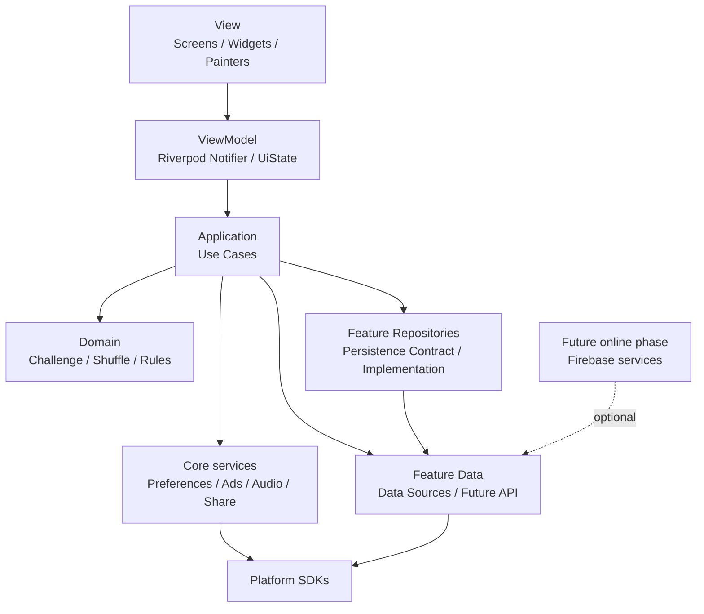
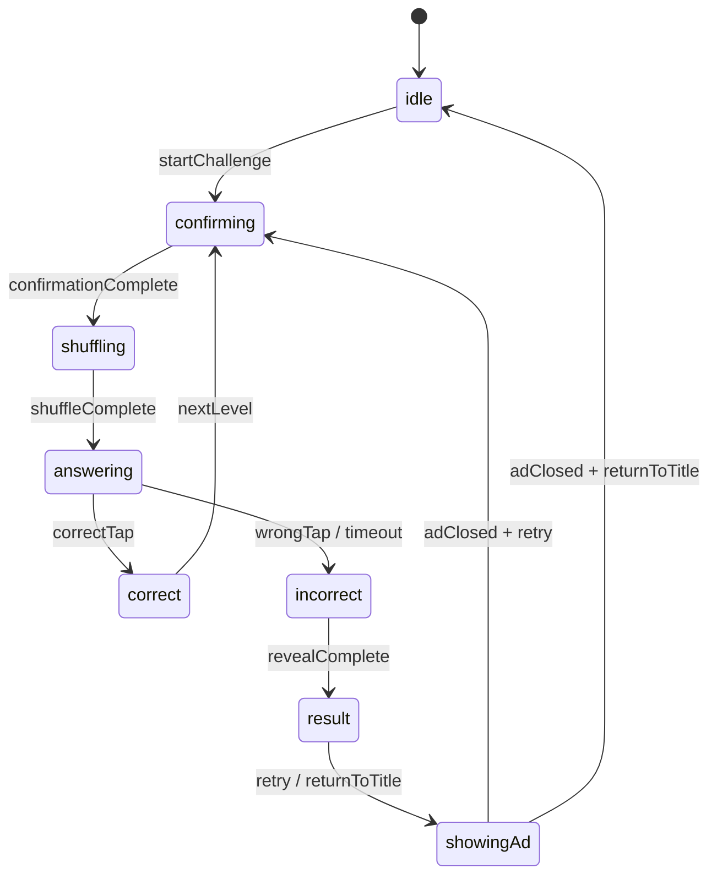

# どっち — 技術設計書（TDD）

| 項目           | 内容                                                                       |
| -------------- | -------------------------------------------------------------------------- |
| プロジェクト名 | どっち / Which One                                                         |
| 文書種別       | 技術設計書（TDD）                                                          |
| ステータス     | Draft                                                                      |
| 最終更新       | 2026-07-30                                                                 |
| 上位文書       | [企画書（Vision）](vision.md)、[ゲームデザインドキュメント（GDD）](gdd.md) |

---

## 1. この文書の役割

本書は「どっち」をiOS・Android向けFlutterアプリとして実装するための技術的な方針を定義する。対象は、アーキテクチャ、状態管理、ゲームロジック、アニメーション、永続化、広告、テストおよび将来のオンライン機能である。

GDDにあるゲームルールを変更するものではない。画面上の演出、秒数、難易度パラメータは、実装後のプレイテストを通じて調整する。

---

## 2. 技術方針と前提

### 2.1 対象プラットフォーム

- iOS・Androidを同一Flutterコードベースで提供する。
- 画面向きは縦向きを基本とする。横向き対応が必要になった場合は別途設計する。
- 初期リリースではオフラインで基本ゲームを完結させる。
- ネットワークが使えない場合も、ゲームプレイとローカル最高到達レベルの記録は可能とする。

### 2.2 採用技術

| 領域               | 採用技術                                            | 用途                                                         |
| ------------------ | --------------------------------------------------- | ------------------------------------------------------------ |
| UI・ゲーム画面     | Flutter                                             | UI、入力、レイアウト、描画の基盤。                           |
| 状態管理           | Riverpod                                            | 依存性注入、画面状態、ゲーム状態。                           |
| 初期アニメーション | Flutter標準の`AnimationController`、`CustomPainter` | 白い円・手のプレースホルダーとシャッフルタイムラインの検証。 |
| 本番アニメーション | Rive                                                | 手・演者のリグ、所作、視覚演出。導入は基本ループ検証後。     |
| ローカル保存       | `shared_preferences`                                | 設定、ローカル最高到達レベル、保存スキーマ版。               |
| 効果音             | `audioplayers`                                      | 短いSEの再生。BGMは実装しない。                              |
| 広告               | Google Mobile Ads SDK                               | 結果画面で遷移操作を選んだ後のインタースティシャル広告。     |
| 結果共有           | `share_plus`                                        | 最高到達レベルの任意共有。                                   |
| テスト             | `flutter_test`、`integration_test`                  | ロジック、UI、実機導線の検証。                               |

採用パッケージの正確なバージョンは、プロジェクト作成時点で互換性が確認できる安定版を固定する。初期リリースにはFirebaseを含めない。

### 2.3 オンライン機能の扱い

全期間の世界ランキングは将来のオンライン機能フェーズで実装する。初期リリースでは、ランキング画面・ランキングアイコン・ランキング送信を実装しない。

将来の候補は次の構成とする。

- Firebase Authentication：匿名ユーザーIDの発行
- Cloud Firestore：ランキング表示用の読み取りモデル
- Cloud Functions：最高到達レベルの検証と順位データの更新

クライアントから数値だけを直接書き込む構成は採用しない。オンライン機能導入時には、チャレンジシード、出題バージョン、回答列などをサーバー側で検証する設計を別途確定する。

---

## 3. アーキテクチャ

### 3.1 方針

Feature-first構成を採用し、各機能ではMVVMをUI設計の基本パターンとする。View、ViewModel、Domain、Dataを次の責務に分ける。

- **View**：Widget、入力イベント、画面遷移、描画。ViewModelが公開するUI状態を描画するだけに留める。
- **ViewModel**：View用の不変なUI状態を公開し、入力をユースケースへ委譲する。Riverpodの`Notifier`で実装する。
- **Application**：ユースケース、状態遷移の調停。ViewModelとDomainを接続する。
- **Domain**：ゲームルール、エンティティ、シャッフル生成、公平性検証
- **Repository**：保存・取得の契約と実装。FeatureのDomainから独立した境界として扱う。
- **Data**：Feature固有のData Source、DTO、将来のAPI接続
- **Core services**：広告、音声、共有、端末保存などの横断的なプラットフォーム連携

ViewModelは`BuildContext`、Widget、Rive、広告SDK、端末ストレージを直接参照しない。Domain層はFlutter Widget、広告SDK、Rive、端末ストレージに依存しない。これにより、シャッフルアルゴリズム、ViewModel、ゲーム状態を高速なユニットテストで検証する。



### 3.2 ディレクトリ構成

```text
lib/
  main.dart
  app/
    app.dart
    app_theme.dart
    bootstrap.dart
  core/
    constants/
    errors/
    services/
      ads/
        interstitial_ad_service.dart
      audio/
        audio_service.dart
      share/
        share_service.dart
    storage/
      app_preferences_store.dart
    utils/
  features/
    game/
      domain/
        entities/
        services/
          difficulty_resolver.dart
          shuffle_generator.dart
          shuffle_validator.dart
        value_objects/
      application/
        use_cases/
          start_challenge_use_case.dart
          submit_answer_use_case.dart
          advance_level_use_case.dart
      repositories/
        challenge_repository.dart
        local_challenge_repository.dart
      data/
        local/
          challenge_local_data_source.dart
      presentation/
        game_screen.dart
        view_models/
          game_view_model.dart
          game_ui_state.dart
        widgets/
        painters/
    result/
      application/
      presentation/
        view_models/
        widgets/
    home/
      application/
      presentation/
        view_models/
        widgets/
    settings/
      application/
      data/
      presentation/
        view_models/
        widgets/
    ranking/                       # 将来のオンライン機能フェーズで追加
      application/
      data/
      domain/
      presentation/
        view_models/
        widgets/
  shared/
    widgets/
    models/
    extensions/

test/
  features/
    game/
      domain/
      application/
      presentation/
        view_models/
  core/
    services/
      ads/
  helpers/
integration_test/
```

`game`、`result`、`home`、`settings`、将来の`ranking`は、同じFeatureテンプレートに従う。すべてのFeatureで空の層を作る必要はないが、必要になった層の配置先は常に`presentation`、`application`、`domain`、`repositories`、`data`のいずれかに統一する。

広告、音声、共有、端末保存は特定画面に閉じない横断的なプラットフォーム連携であるため、`core`に配置する。機能間で直接Data層を参照しない。たとえば`GameViewModel`は広告SDKを直接呼ばず、アプリケーション層のユースケースまたは`core/services/ads`の`InterstitialAdService`抽象に依存する。

### 3.3 UseCase・Service・Repositoryの責務

`Service`という語を単独で使わず、次の3種類を明確に区別する。

| 種別           | 配置                     | 責務                                                                                                     | 代表例                                                       | 依存してよい対象                       |
| -------------- | ------------------------ | -------------------------------------------------------------------------------------------------------- | ------------------------------------------------------------ | -------------------------------------- |
| UseCase        | `application/use_cases/` | ユーザー操作・アプリ操作を1つ完結させる。RepositoryとDomain Serviceを組み合わせ、結果をViewModelへ返す。 | `StartChallengeUseCase`、`SubmitAnswerUseCase`               | Domain、Repository、Core Serviceの抽象 |
| Domain Service | `domain/services/`       | EntityやValue Objectに属さない、純粋なゲームルール・計算を提供する。副作用を持たない。                   | `ShuffleGenerator`、`ShuffleValidator`、`DifficultyResolver` | Domainのみ                             |
| Core Service   | `core/services/`         | 外部SDK・OS・端末機能を隠蔽する。ゲームルールを持たない。                                                | `InterstitialAdService`、`AudioService`、`ShareService`      | 対応するSDKのみ                        |
| Repository     | `repositories/`          | 保存・取得の境界を提供する。ドメインルールを持たない。                                                   | `ChallengeRepository`、`LocalChallengeRepository`            | Data Source、Core Storage              |

依存方向は、`View → ViewModel → UseCase → Domain Service / Repository / Core Service`とする。Domain ServiceはRepository、Core Service、ViewModel、Flutter SDKを参照してはならない。Repositoryの実装はData Sourceや`core/storage`を利用できるが、ゲームの判定ロジックを持たない。

---

## 4. ゲーム状態設計

### 4.1 状態機械

ゲームの進行は、画面上の一時的な表示ではなく明示的な状態機械として管理する。



| 状態         | 責務                                         | 入力                   |
| ------------ | --------------------------------------------- | ---------------------- |
| `idle`       | タイトル・開始待ち                           | 開始、設定、共有       |
| `confirming` | コイン位置を明確に示す                       | 入力なし               |
| `shuffling`  | シャッフルタイムラインを実行する             | 入力なし               |
| `answering`  | 手へのタップと制限時間を受け付ける           | 1回の回答のみ          |
| `correct`    | 正解演出、レベル加算、次問準備               | 入力なし               |
| `incorrect`  | 選択位置と正解位置を明示する                 | 入力なし               |
| `result`     | 最高到達レベル、正解位置、遷移操作を表示する | 再挑戦、タイトルへ戻る |
| `showingAd`  | 広告表示と広告失敗時のフォールバックを行う   | 入力なし               |

アプリの非アクティブ化を専用の状態としては扱わない。`confirming`/`shuffling`/`answering`いずれのタイマーも、非アクティブ化中に停止・一時停止せず進み続ける（詳細は[ADR 0004](./decisions/0004-no-pause-on-inactive.md)）。

状態をまたぐ非同期処理には、現在のチャレンジIDを付与する。古い広告コールバックやタイマーが、新しいチャレンジの状態を変更してはならない。

### 4.2 ViewModelとRiverpodの責務

| Provider / Notifier           | 責務                                                                                |
| ----------------------------- | ----------------------------------------------------------------------------------- |
| `gameViewModelProvider`       | `GameUiState`を公開し、開始・回答・時間切れ・再挑戦の入力をユースケースへ委譲する。 |
| `resultViewModelProvider`     | 結果画面用の最高到達レベル、正解位置、遷移要求を公開する。                          |
| `settingsViewModelProvider`   | 設定画面用の状態と設定変更を管理する。                                              |
| `shuffleGeneratorProvider`    | Domain Service。難易度に合う`ShufflePlan`を生成する。                               |
| `challengeRepositoryProvider` | Repository抽象。ローカル最高到達レベルの読み書きを提供する。                        |
| `adControllerProvider`        | Core Service。広告の事前読み込み、表示、失敗時の遷移継続を提供する。                |
| `audioServiceProvider`        | Core Service。SEを再生し、ゲームルールには影響しない。                              |
| `shareServiceProvider`        | Core Service。OSの共有シートを起動する。                                            |

`GameViewModel`は1チャレンジのUI状態だけを保持する。アプリ全体の設定や広告ロード状態をゲームUI状態に混在させない。UI状態は`GamePhase`、手の表示情報、残り時間、現在レベル、回答結果、入力可否を持つ不変オブジェクトとする。

---

## 5. ドメインモデルとデータ構造

### 5.1 位置と手

```text
PerformerPosition
  frontLeft | frontCenter | frontRight
  rearLeft | rearCenter | rearRight

HandId
  performerPosition: PerformerPosition
  handIndex: 0 | 1

制約
  frontLeft / frontCenter / frontRight: handIndex 0 または 1
  rearLeft / rearCenter / rearRight: handIndex 0 のみ
```

前景は最大3人・各2本、背後は最大3人・各1本とし、同時に存在する手は最大9本とする。背後の手は回答フェーズで低明度・影付きの表現にするが、`HandId`自体は前景と同じように判定対象である。

### 5.2 チャレンジとシャッフル

| モデル              | 主要フィールド                                                 | 説明                             |
| ------------------- | -------------------------------------------------------------- | -------------------------------- |
| `DifficultyProfile` | `level`、`performerCount`、`allowedMoves`、`answerTimerConfig` | レベルごとの生成条件。           |
| `ChallengeSession`  | `id`、`level`、`highestLevel`、`seed`、`plan`、`phase`         | 1回の連続チャレンジの実行状態。  |
| `ShufflePlan`       | `seed`、`initialHolder`、`steps`、`finalHolder`                | 1問分の再現可能な動作列。        |
| `ShuffleStep`       | `start`、`duration`、`type`、`actors`、`parameters`            | タイムライン上の原子的な動作。   |
| `AnswerResult`      | `selectedHand`、`correctHand`、`isCorrect`、`isTimedOut`       | 回答判定の不変な結果。           |
| `LocalProfile`      | `bestLevel`、`settings`、`schemaVersion`                       | 端末に保存する最小プロフィール。 |

`ShuffleStep.type`は`move`、`pause`、`cross`、`transfer`、`feint`、`exitStage`、`enterStage`とする。`transfer`だけがコイン保持手を変更できる。`feint`は見た目が似ていても保持手を変更しない。

`AnswerTimerConfig`は、固定時間または候補時間からのランダム選択を表す。初期リリースでは全レベルを固定30秒とする。将来はレベルごとに候補時間と選択確率を設定できるようにし、選ばれた制限時間を`ShufflePlan`へ記録する。回答フェーズ開始後に制限時間を変更しない。

### 5.3 シャッフル生成と検証

1. `DifficultyProfile`から、使える演者、手、動作、速度、回答タイマー設定を決定する。
2. シード付き乱数で`ShufflePlan`を生成する。
3. 各`ShuffleStep`を順に適用し、常にコイン保持手が1本だけになることを確認する。
4. `ShuffleValidator`が受け渡し、背後移動、出現頻度、正解位置の偏り、公平性を検証する。
5. 検証に失敗した計画は破棄し、別のシードで再生成する。
6. 検証済みの計画だけをPresentation層へ渡す。

乱数シードと難易度プロファイルは、再現テストと将来のオンライン検証に備えて保持する。初期リリースではチャレンジ履歴を端末外へ送信しない。

---

## 6. 描画・アニメーション・入力

### 6.1 初期実装

Phase 1では、白背景上の円または単純な手のプレースホルダーを`CustomPainter`で描画する。`ShufflePlan`の経過時間から各手の位置・回転・前後順を算出し、画面サイズに対する正規化座標でレイアウトする。

- 座標は`0.0`〜`1.0`のステージ座標で保持し、実画面のピクセルへ変換する。
- タップ領域は描画領域とは別に計算し、最小44 logical pixel以上を確保する。
- 重なった手は`zIndex`で描画順を決めるが、回答フェーズでは候補ごとのタップ可能領域が衝突しないように調整する。
- 背後の手は、低明度、影、縮小率、背後の`zIndex`で表現する。黒一色で輪郭を失わせない。

### 6.2 Rive導入後

Riveは手・腕・演者の見た目を担う。コインの真の保持状態、シャッフルタイムライン、回答判定はDartのDomain/Application層が唯一の情報源とする。

- Rive State Machineへは位置・動作種別・向きなどの表示入力のみ渡す。
- Riveのアニメーション完了イベントをゲームの正誤判定に使わない。
- Riveアセットの読み込み失敗時には、プレースホルダー描画でゲームを継続できるようにする。

### 6.3 回答タイマー

`answering`への遷移時に単一の回答タイマーを開始する。初期リリースの制限時間は全レベル30秒とする。残り時間は常にUIへ公開・表示し、将来の短時間ランダム出題でも、回答開始時にプレイヤーが残り時間を認識できるようにする。

- タップまたは時間切れの最初のイベントだけを受理する。
- 状態遷移時と`dispose`時に必ずタイマーを破棄する。
- 制限時間は`DifficultyProfile.answerTimerConfig`から決定し、選択結果は`ShufflePlan`に保持する。秒数はRemote Configではなくローカル設定値として管理する。
- 将来のランダム出題では、問題生成時に候補時間から1つだけ選ぶ。回答フェーズの途中で短縮・延長することはない。

---

## 7. 永続化

### 7.1 保存対象

`SharedPreferencesAsync`を介して、次の小さな値だけを端末へ保存する。

| キー                      | 型     | 内容                             |
| ------------------------- | ------ | -------------------------------- |
| `profile.bestLevel`       | `int`  | 端末上の最高到達レベル。         |
| `settings.soundEnabled`   | `bool` | SEの有効・無効。                 |
| `settings.hapticsEnabled` | `bool` | 触覚フィードバックの有効・無効。 |
| `storage.schemaVersion`   | `int`  | 保存形式の移行用バージョン。     |

保存失敗時でもチャレンジを停止しない。メモリ上の結果を表示し、次回の保存機会に再試行する。

### 7.2 プライバシー

初期リリースではアカウント、メールアドレス、任意のユーザー名を保存しない。広告SDKや共有SDKが取得する情報と同意取得は、公開地域・ストア要件に従い別途設定する。

---

## 8. 広告・音声・共有

### 8.1 広告

広告はゲームの状態遷移を壊さないよう、`InterstitialAdService`で隔離する。

1. アプリ起動後、または前回広告の終了後に次の広告を事前ロードする。
2. 結果画面で`RETRY`またはタイトルへ戻る操作が選ばれる。
3. 広告が準備済みなら表示する。未準備・失敗・表示不能なら、広告を待たずに目的の画面へ遷移する。
4. 閉じる・失敗・スキップのいずれでも、遷移は必ず1回だけ実行する。

開発時は必ずテスト用広告ユニットIDを使う。本番用の広告IDはソースコードに直接書かず、プラットフォーム設定または安全なビルド設定から読む。

### 8.2 音声

効果音は`AudioService`を経由して再生し、コイン保持手などのゲーム状態を変えない。

- 実際の受け渡し、フェイント、正解、不正解、時間切れを個別のイベントとして扱う。
- 音声が読み込めない・ミュートの場合も、視覚情報だけで正答できる。
- 音の再生遅延は、判定ではなく演出側で吸収する。

### 8.3 共有

共有用の文字列はローカルの`bestLevel`または直近のチャレンジ結果から生成する。初期版では、共有先のサービスを指定せずOS標準の共有シートを開く。

共有文の例：`どっち — 最高到達 Level 12。あなたはどこまで見抜ける？`

---

## 9. 例外・ライフサイクル

| 状況                   | 方針                                                                                                           |
| ---------------------- | -------------------------------------------------------------------------------------------------------------- |
| 広告のロード・表示失敗 | 広告なしで、ユーザーが選んだ遷移先へ進む。                                                                     |
| 保存失敗               | プレイは継続し、後続の保存で再試行する。                                                                       |
| Riveアセット読込失敗   | プレースホルダー描画へフォールバックする。                                                                     |
| 音声読込失敗           | 無音で継続する。                                                                                               |
| アプリが非アクティブ化 | 一時停止しない。シャッフルタイムライン・回答タイマーとも実時間で進行し続け、離れていた分だけ不利になる（ADR 0004）。 |
| OSによりプロセスが終了 | 進行中チャレンジは復元しない。ローカル最高到達レベルと設定のみ復元する。                                       |
| 画面サイズ変更         | 正規化座標から再レイアウトし、ゲーム状態を維持する。                                                           |

---

## 10. テスト戦略

### 10.1 ユニットテスト

- `ShufflePlan`の各時点でコイン保持手が一意であること
- `transfer`以外でコイン保持手が変更されないこと
- 背後位置への移動に必要な手掛かりが含まれること
- 同一シードで同一のシャッフル計画が再現されること
- `GameViewModel`の正解、不正解、時間切れ、二重タップの状態遷移
- `bestLevel`が正解時だけ更新されること
- 広告の成功・失敗・未ロード時も遷移が1回だけ行われること
- アプリの非アクティブ化を挟んでも状態機械・タイマーが破綻しないこと（一時停止はしない）

### 10.2 Widgetテスト

- `answering`以外で手をタップしても回答にならないこと
- 回答候補の手に十分なタップ領域があること
- 時間切れで正解位置の提示に進むこと
- 結果画面にランキング導線がないこと
- 広告後に`RETRY`がLevel 1へ戻ること

### 10.3 統合テスト

iOS・Androidの実機またはエミュレータで、少なくとも以下を確認する。

- アプリ起動からチャレンジ開始、不正解、広告を経た再挑戦
- 広告が利用不可でも再挑戦・タイトル復帰が可能
- アプリ再起動後もローカル最高到達レベルと設定が維持される
- 端末の画面サイズが異なっても手を正しくタップできる
- バックグラウンド移行から復帰しても、経過した実時間分だけ進んだ状態（タイムアウト含む）でクラッシュせず継続できる

---

## 11. 実装順序

1. Flutterプロジェクト、Riverpod、テーマ、タイトル画面を用意する。
2. 円のプレースホルダー、`GameViewModel`、状態機械、手の直接タップを実装する。
3. シード付き`ShufflePlan`、Level 1〜3、時間制限、公平性テストを実装する。
4. 結果画面、ローカル最高到達レベル、再挑戦を実装する。
5. 広告と広告失敗時のフォールバックを実装する。
6. SE、共有、難易度帯、複数の手を追加する。
7. Riveアセットと背後位置を導入する。
8. 将来フェーズでFirebaseベースの世界ランキングを追加する。

---

## 12. 未決定事項

- 結果共有をタイトル画面と設定画面のどちらから起動するか
- 広告の本番ユニットID管理、同意取得、広告がない地域での運用
- Riveアセットの制作方法、ライセンス、読み込みサイズ上限
- Firebase導入時のランキング検証方式と不正対策
